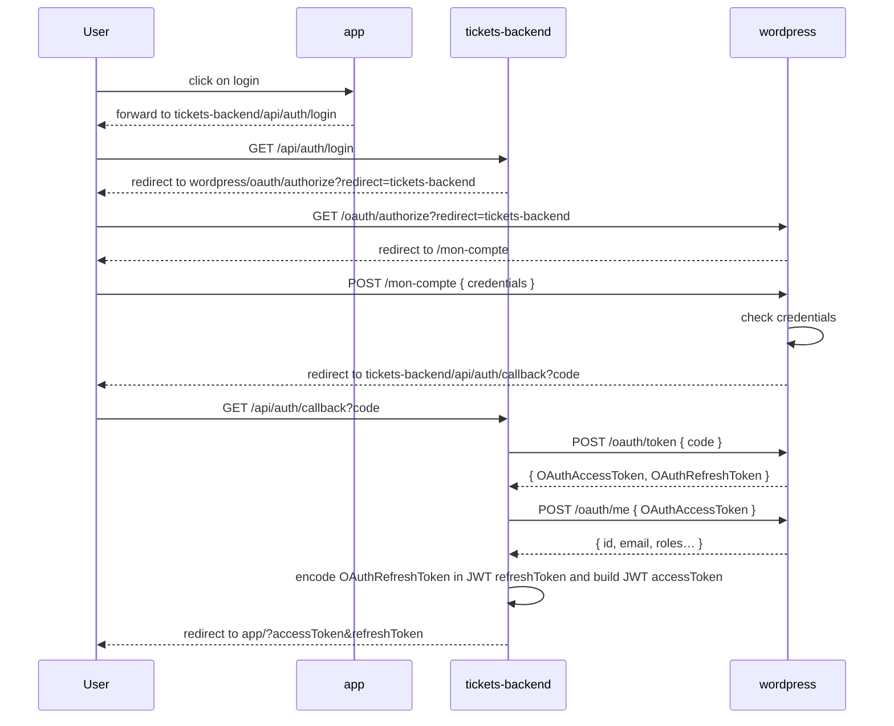
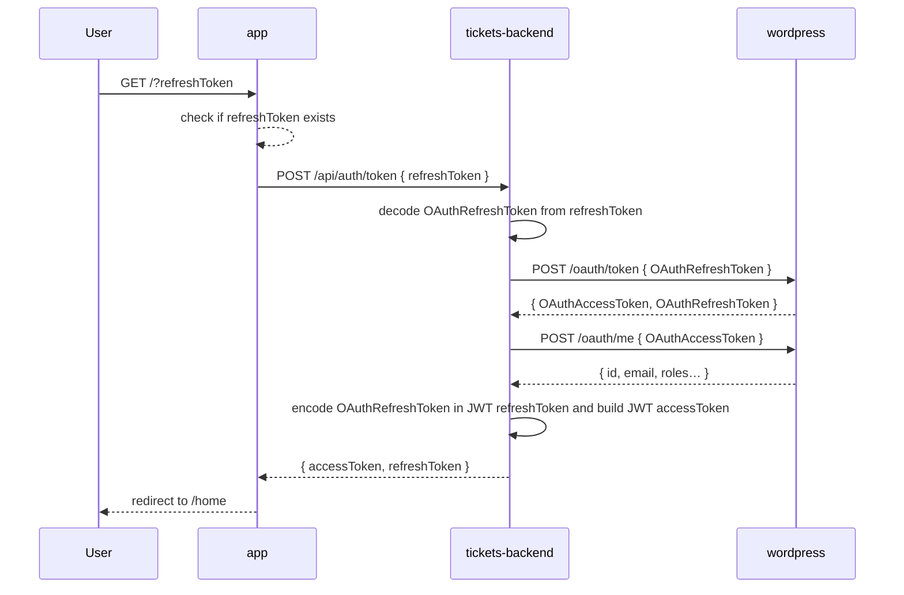

# Authentication

How to retrieve a refresh token:
- Foward users to `tickets-backend/api/auth/login`,
- Users will authenticate themself on `https://www.coworking-metz.fr/`,
- If authorized, users will be redirected to the origin
with `accessToken` and `refreshToken` as query parameters.

By default, `tickets-backend` will set the origin url to the `Referer` request header
when forwarding users to `tickets-backend/api/auth/login`.
It can be overriden by setting the `follow` query parameter.

Some examples:
- when users navigate to `tickets-backend/api/auth/login` from `http://your-app.local`, they will be redirected to `http://localhost:5173` if `http://localhost:5173` is included in `OAUTH_FOLLOW_WHITELIST` environement variable, otherwise to `tickets-backend/api/auth/callback` with an error message.
- when users navigate to `tickets-backend/api/auth/login?follow=http://example.com` from `http://localhost:5173`, they will be redirected to `http://example.com` if `http://example.com` is included in `OAUTH_FOLLOW_WHITELIST` environement variable, otherwise to `tickets-backend/api/auth/callback` with an error message.

Here is a sequence diagram on how it works behind the scene:


# Authorization

How to retrieve an access token:
- Check if you have a refresh token, otherwise [authenticate](#authentication),
- Make a POST HTTP request to `tickets-backend/api/auth/tokens` with the `refreshToken` in the body in the JSON format.
```bash
curl -X POST -H "Content-Type: application/json"  -d '{"refreshToken":"USER_REFRESH_TOKEN"}' http://tickets-backend/api/auth/tokens
```
- You will receive:
  - `accessToken`: used to authorize HTTP request made to private endpoints,
  - `refreshToken`: used to retrieve new tokens,
  - `user`: informations about the user.

How it works behind the scene:

